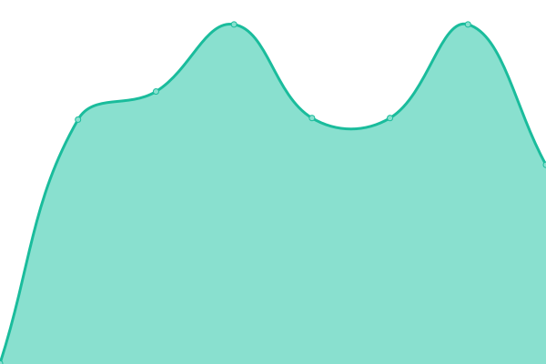
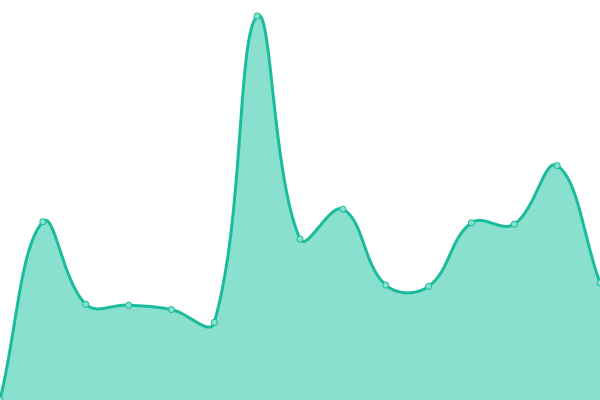
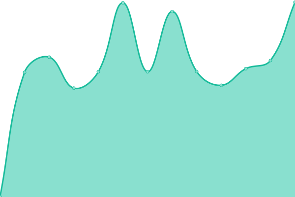
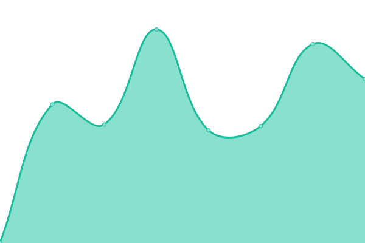
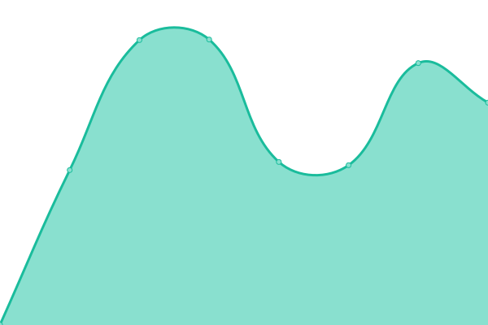
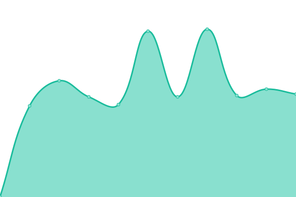

# [📈 Live Status](https://demo.upptime.js.org): <!--live status--> **🟩 All systems operational**

This repository contains the open-source uptime monitor and status page for [L&D Support](www.ldsupport.com), powered by [Upptime](https://github.com/upptime/upptime).

With [Upptime](https://upptime.js.org), you can get your own unlimited and free uptime monitor and status page, powered entirely by a GitHub repository. We use [Issues](https://github.com/LDSupport/status/issues) as incident reports, [Actions](https://github.com/LDSupport/status/actions) as uptime monitors, and [Pages](https://demo.upptime.js.org) for the status page.

<!--start: status pages-->
<!-- This summary is generated by Upptime (https://github.com/upptime/upptime) -->
<!-- Do not edit this manually, your changes will be overwritten -->
<!-- prettier-ignore -->
| URL | Status | History | Response Time | Uptime |
| --- | ------ | ------- | ------------- | ------ |
|  [Identity Server](https://auth.ldsupport.nl/debug/healthz) | 🟩 Up | [identity-server.yml](https://github.com/LDSupport/status/commits/HEAD/history/identity-server.yml) | 

 523ms
     
 | 

<a href="https://LDSupport.github.io/status/history/identity-server">100.00%</a>
    

|  [CoachYourself.online](https://app.coachyourself.online) | 🟩 Up | [coach-yourself-online.yml](https://github.com/LDSupport/status/commits/HEAD/history/coach-yourself-online.yml) | 

 801ms
     
 | 

<a href="https://LDSupport.github.io/status/history/coach-yourself-online">100.00%</a>
    

|  [Dynamic Managing (Old)](https://dynamicmanaging.com) | 🟩 Up | [dynamic-managing-old.yml](https://github.com/LDSupport/status/commits/HEAD/history/dynamic-managing-old.yml) | 

 566ms
     
 | 

<a href="https://LDSupport.github.io/status/history/dynamic-managing-old">100.00%</a>
    

|  [Lite - Dynamic Managing](https://lite.dynamicmanaging.com) | 🟩 Up | [lite-dynamic-managing.yml](https://github.com/LDSupport/status/commits/HEAD/history/lite-dynamic-managing.yml) | 

 543ms
     
 | 

<a href="https://LDSupport.github.io/status/history/lite-dynamic-managing">100.00%</a>
    

|  [Analyzer.global](https://ld.analyzer.global) | 🟩 Up | [analyzer-global.yml](https://github.com/LDSupport/status/commits/HEAD/history/analyzer-global.yml) | 

 804ms
     
 | 

<a href="https://LDSupport.github.io/status/history/analyzer-global">100.00%</a>
    

|  [Chimera](https://chimera.ldscc.com) | 🟩 Up | [chimera.yml](https://github.com/LDSupport/status/commits/HEAD/history/chimera.yml) | 

 751ms
     
 | 

<a href="https://LDSupport.github.io/status/history/chimera">100.00%</a>
    

<!--end: status pages-->

[**Visit our status website →**](https://demo.upptime.js.org)

## 📄 License

- Powered by: [Upptime](https://github.com/upptime/upptime)
- Code: [MIT](./LICENSE) © [Anand Chowdhary](https://anandchowdhary.com), supported by [Pabio](https://pabio.com)
- Data in the `./history` directory: [Open Database License](https://opendatacommons.org/licenses/odbl/1-0/)
